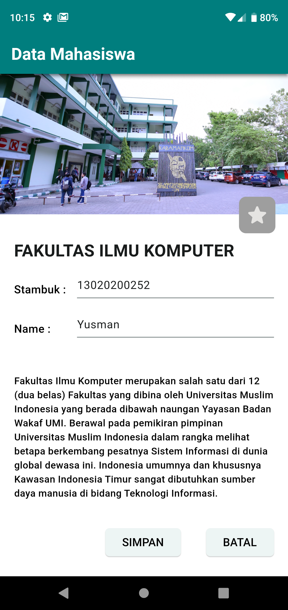

# Pemrograman_Mobile_Yusman
Repository untuk menyimpan source code praktikum dari mata kuliah pemrograman mobile

### TUGAS 1 [FlUTTER]

|       |

### MODUL 1 : BAGIAN 1 – EXPLICIT INTENT
[ss_c2prak1a13020200252.webm](https://github.com/yusmnn/Pemrograman_Mobile_Yusman/assets/76932249/23a1fbae-71a8-49b3-bb85-c4b7d63e345f)

### MODUL 1 : BAGIAN 2 – IMPLICIT INTENT

|       |
|       |

### MODUL 2 : INPUT CONTROL
|       |
|       |

### MID PRAKTIKUM
|       |

